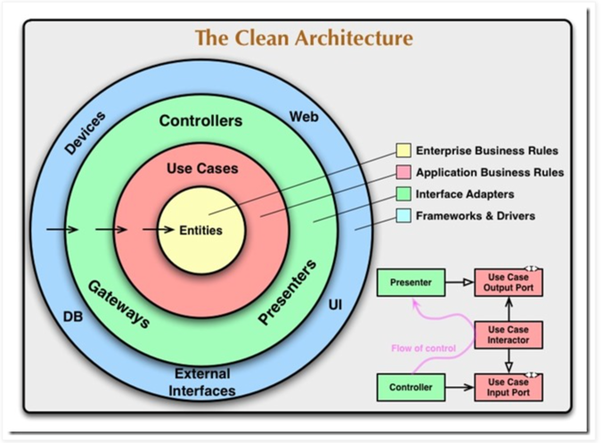

# Clean Architecture 同心圓架構詳解

## 概述

本文檔詳細說明 Clean Architecture 的同心圓架構模型，以及各組件在實際專案中的對應關係。

---

## Clean Architecture 同心圓圖


> **圖片說明：** Clean Architecture 的同心圓分層架構，展示了依賴方向與控制流程。

---

## 核心原則

### 1. 明確分層

Clean Architecture 採用同心圓的分層結構，從內到外分為四層：

```
【圓心】
Entities (Enterprise Business Rules)
黃色 - 企業業務規則
    ↑
Use Cases (Application Business Rules)  
粉紅色 - 應用業務規則
    ↑
Interface Adapters
綠色 - 接口適配器
    ↑
【最外層】
Frameworks & Drivers
藍色 - 框架與驅動程式
```

### 2. 依賴規則（The Dependency Rule）

**核心原則：依賴方向永遠指向圓心（內層）**

- ✅ 外層可以依賴（知道）內層
- ❌ 內層絕對不能依賴（知道）外層
- ✅ 圓心（Entities）是最純粹的，不依賴任何外部

**圖中的箭頭：** 所有箭頭都指向圓心，代表依賴方向。

---

## 各層詳細說明

### 第一層：Entities（企業業務規則）- 黃色圓心

**位置：** 最內層（圓心）

**職責：**
- 封裝企業級的業務規則
- 定義最核心的領域模型
- 完全獨立，不依賴任何外部

**本專案對應：** `core/domain/`
```
core/domain/
├── cart.py              # Cart, CartItem 領域模型
└── order/               # Order 聚合
    ├── order.py
    ├── order_item.py
    └── ...
```

**範例：**
```python
# core/domain/cart.py
@dataclass
class Cart:
    """購物車聚合根（Entity）"""
    user_id: str
    items: List[CartItem] = field(default_factory=list)
    
    def add_item(self, product_id: str, unit_price: int, quantity: int):
        """業務規則：加入商品到購物車"""
        # 純粹的業務邏輯，無任何外部依賴
        ...
```

---

### 第二層：Use Cases（應用業務規則）- 粉紅色

**位置：** 第二層

**職責：**
- 定義應用程式的用例（Use Cases）
- 協調 Entities 完成特定業務流程
- 包含應用特定的業務規則

**本專案對應：** `core/services/`
```
core/services/
├── cart_service.py      # 購物車用例
└── order_service.py     # 訂單用例
```

**範例：**
```python
# core/services/cart_service.py
class CartService:
    """購物車用例服務（Use Case Interactor）"""
    
    def __init__(self, cart_repo: CartRepository):
        self.cart_repo = cart_repo
    
    def add_item(self, user_id: str, product_id: str, ...):
        """用例：加入商品到購物車"""
        cart = self.cart_repo.get_by_user_id(user_id)
        cart.add_item(product_id, unit_price, quantity)
        self.cart_repo.save(cart)
        return cart
```

---

### 第三層：Interface Adapters（接口適配器）- 綠色

**位置：** 第三層

**職責：**
- 轉換數據格式（外部 ↔ 內部）
- 包含 Controllers、Presenters、Gateways
- 適配外部接口與內部用例

**本專案對應：** `api/` + `core/repositories/`（接口定義）
```
api/
├── carts.py             # Controllers
├── schemas/             # API Schema
│   └── cart.py
└── utils/
    └── converters/      # Presenters
        └── cart.py

core/repositories/
└── cart_repository.py   # Repository 接口（Gateway）
```

**範例：**
```python
# api/carts.py - Controller
@router.post("/cart/items")
def add_item(body: AddItemIn, service: CartService = ...):
    """Controller: 處理 HTTP 請求"""
    cart = service.add_item(...)  # 調用 Use Case
    return cart_out_from_domain(cart)  # 使用 Presenter

# api/utils/converters/cart.py - Presenter
def cart_out_from_domain(cart: Cart) -> CartOut:
    """Presenter: Domain Model → API Schema"""
    return CartOut(user_id=cart.user_id, ...)
```

---

### 第四層：Frameworks & Drivers（框架與驅動）- 藍色

**位置：** 最外層

**職責：**
- 具體的技術實現細節
- 資料庫、Web 框架、UI、外部服務等
- 可替換的實現

**本專案對應：** `infra/`
```
infra/
├── db/
│   ├── models/          # SQLAlchemy ORM
│   ├── repositories/    # Repository 實現
│   └── session.py       # 資料庫連接
├── cache/
│   └── redis_client.py  # Redis 實現
└── wiring/              # 依賴注入機制
```

**範例：**
```python
# infra/db/repositories/cart_repository_impl.py
class CartRepositoryImpl(CartRepository):
    """Repository 具體實現（使用 SQLAlchemy）"""
    
    def get_by_user_id(self, user_id: str) -> Optional[Cart]:
        # 使用 SQLAlchemy 查詢資料庫
        rows = self.session.query(CartItemModel).filter_by(user_id=user_id).all()
        # 轉換為 Domain Model
        return Cart(user_id=user_id, items=[...])
```

---

## 右下角組件詳解

圖中右下角展示了跨層級互動的詳細機制，這是 Clean Architecture 的核心設計模式。

### 1. Controller（控制器）

**位置：** 綠色區域（Interface Adapters）

**職責：**
- 接收外部請求（HTTP、CLI、事件等）
- 將外部格式轉換為 Use Case 能理解的格式
- 調用 Use Case Input Port

**本專案對應：** `api/carts.py` 中的路由函數

```python
@router.post("/cart/items")  # ← HTTP 端點
def add_item(  # ← Controller
    body: AddItemIn,  # ← 外部格式（JSON → Pydantic）
    service: CartService = Depends(get_cart_service),
):
    # 轉換並調用 Use Case
    cart = service.add_item(
        user_id=body.user_id,
        product_id=body.product_id,
        quantity=body.quantity,
        unit_price=body.unit_price,
    )
    return cart_out_from_domain(cart)
```

---

### 2. Use Case Input Port（輸入埠）

**位置：** 粉紅色區域（Use Cases）

**職責：**
- 定義 Use Case 的輸入接口（抽象契約）
- 聲明用例所需的參數
- 提供清晰的輸入邊界

**本專案對應：** Service 類別的方法簽名

```python
class CartService:
    def add_item(  # ← Use Case Input Port
        self,
        user_id: str,      # ← 輸入參數
        product_id: str,
        quantity: int,
        unit_price: int
    ) -> Cart:  # ← 返回類型（Output Port）
        """用例輸入接口"""
        ...
```

**關鍵點：**
- Input Port 定義了「如何調用這個用例」
- Controller 通過 Input Port 與 Use Case 互動
- 這是一個抽象的邊界，保護內層不被外層污染

---

### 3. Use Case Interactor（用例交互器）

**位置：** 粉紅色區域（Use Cases）

**職責：**
- 實際執行業務邏輯的組件
- Use Case 的具體實現
- 協調 Entities 和 Repositories 完成用例

**本專案對應：** `core/services/cart_service.py` 的完整實現

```python
class CartService:  # ← Use Case Interactor
    def __init__(self, cart_repo: CartRepository):
        self.cart_repo = cart_repo
    
    def add_item(self, user_id: str, product_id: str, quantity: int, unit_price: int):
        """Use Case Interactor: 執行實際業務邏輯"""
        
        # 1. 獲取或創建購物車（協調 Repository）
        cart = self.cart_repo.get_by_user_id(user_id)
        if not cart:
            cart = Cart(user_id=user_id)
        
        # 2. 執行業務邏輯（使用 Entity）
        cart.add_item(product_id, unit_price, quantity)
        
        # 3. 持久化（通過 Repository）
        self.cart_repo.save(cart)
        
        # 4. 返回結果（通過 Output Port）
        return cart
```

**關鍵點：**
- Interactor 是 Use Case 的「大腦」
- 它協調多個組件完成業務流程
- 它依賴抽象（Repository 接口），而非具體實現

---

### 4. Use Case Output Port（輸出埠）

**位置：** 粉紅色區域（Use Cases）

**職責：**
- 定義 Use Case 的輸出接口（抽象契約）
- 聲明用例的返回值
- 提供清晰的輸出邊界

**本專案對應：** Service 方法的返回值（Domain Model）

```python
def add_item(...) -> Cart:  # ← Use Case Output Port
    """返回 Domain Model（而非 API Schema）"""
    return cart  # ← 返回領域模型
```

**關鍵點：**
- Output Port 返回的是 **Domain Model**，而非外部格式
- 這保持了 Use Case 層的純粹性
- 外層負責將 Domain Model 轉換為所需格式

---

### 5. Presenter（呈現器）

**位置：** 綠色區域（Interface Adapters）

**職責：**
- 將 Use Case 的輸出（Domain Model）轉換為外部格式
- 可以是 API Schema、HTML、JSON、XML 等任何格式
- 實現 Output Port 的一個 Adapter

**本專案對應：** `api/utils/converters/cart.py`

```python
# api/utils/converters/cart.py
def cart_out_from_domain(cart: Cart) -> CartOut:
    """
    Presenter: 將 Domain Model 轉換為 API Schema
    
    從 Use Case Output Port 接收 Domain Model，
    轉換為外部 API 需要的格式
    """
    return CartOut(
        user_id=cart.user_id,
        items=[
            CartItemOut(
                product_id=item.product_id,
                quantity=item.quantity,
                unit_price=item.unit_price,
            )
            for item in cart.items
        ],
        total=cart.total_amount(),  # 可以調用 Domain Model 的方法
    )
```

**關鍵點：**
- Presenter 是 Output Port 的一個 Adapter
- 不同的客戶端可以有不同的 Presenter（Web、Mobile、CLI）
- Presenter 依賴 Domain Model，但 Domain Model 不知道 Presenter 的存在

---

### 6. Flow of Control（控制流程曲線）

**紫色曲線的意義：** 展示了實際的**執行流程方向**

**為什麼需要這條曲線？**

這是 Clean Architecture 最精妙的設計：
- **依賴方向（箭頭）**：指向圓心（內層依賴）
- **控制流程（曲線）**：可以跨越邊界（執行流程）

**曲線的路徑：**

```
開始
  ↓
1. Controller 接收請求（綠色層）
  ↓
2. Controller 調用 Use Case Input Port
  ↓
3. Use Case Interactor 執行業務邏輯（粉紅色層）
  ↓
4. Interactor 返回結果到 Use Case Output Port
  ↓ 【曲線彎曲處】
5. Presenter 接收 Domain Model（綠色層）
  ↓
6. Presenter 轉換為外部格式
  ↓
返回給 Controller
  ↓
結束
```

**關鍵洞察：**

雖然控制流程從 Use Case 回到外層（Presenter），但**依賴方向沒有改變**：
- Presenter **依賴** Domain Model（指向圓心）
- Domain Model **不知道** Presenter 的存在
- 這就是**依賴倒置原則**的體現

---

## 完整流程示例

讓我們用一個完整的例子來展示所有組件如何協作：

### 場景：用戶加入商品到購物車

```
【HTTP 請求】
POST /api/cart/items
{
  "user_id": "user123",
  "product_id": "prod456",
  "quantity": 2,
  "unit_price": 1000
}

↓

【1. Controller】 api/carts.py
接收 HTTP 請求，解析 JSON

@router.post("/cart/items")
def add_item(body: AddItemIn, service: CartService = ...):
    ↓
    
【2. Use Case Input Port】
    service.add_item(
        user_id=body.user_id,
        product_id=body.product_id,
        quantity=body.quantity,
        unit_price=body.unit_price,
    )
    ↓
    
【3. Use Case Interactor】 core/services/cart_service.py
執行業務邏輯

class CartService:
    def add_item(self, ...):
        cart = self.cart_repo.get_by_user_id(user_id)
        cart.add_item(product_id, unit_price, quantity)
        self.cart_repo.save(cart)
        return cart  # ← Domain Model
    ↓
    
【4. Use Case Output Port】
返回 Cart (Domain Model)
    ↓ 【控制流程彎曲】
    
【5. Presenter】 api/utils/converters/cart.py
轉換 Domain Model → API Schema

def cart_out_from_domain(cart: Cart) -> CartOut:
    return CartOut(
        user_id=cart.user_id,
        items=[...],
        total=cart.total_amount(),
    )
    ↓
    
【6. Controller】
返回 API Schema 給客戶端
    ↓

【HTTP 回應】
200 OK
{
  "user_id": "user123",
  "items": [
    {
      "product_id": "prod456",
      "quantity": 2,
      "unit_price": 1000
    }
  ],
  "total": 2000
}
```

---

## 與本專案的完整對應表

| Clean Architecture 組件 | 本專案對應 | 檔案路徑 | 職責 |
|------------------------|----------|---------|------|
| **Entities** | Domain Models | `core/domain/cart.py` | 領域實體和業務規則 |
| **Use Cases** | Services | `core/services/cart_service.py` | 應用用例 |
| **Use Case Input Port** | Service 方法簽名 | `CartService.add_item(...)` | 輸入接口定義 |
| **Use Case Interactor** | Service 方法實現 | `CartService.add_item() {...}` | 用例執行器 |
| **Use Case Output Port** | Service 返回值 | `-> Cart` | 輸出接口定義 |
| **Controller** | API 路由函數 | `api/carts.py::add_item()` | HTTP 請求處理 |
| **Presenter** | Converter 函數 | `api/utils/converters/cart.py` | 格式轉換 |
| **Gateways** | Repository 接口 | `core/repositories/cart_repository.py` | 數據訪問抽象 |
| **Frameworks & Drivers** | Infrastructure | `infra/db/repositories/` | 具體實現 |

---

## 依賴方向驗證

讓我們驗證本專案是否遵循依賴規則：

### ✅ 正確的依賴方向

```python
# api/carts.py (外層)
from app.core.services.cart_service import CartService  # ✅ 依賴內層
from app.api.schemas.cart import CartOut  # ✅ 同層
from app.api.utils.converters.cart import cart_out_from_domain  # ✅ 同層

# core/services/cart_service.py (中層)
from app.core.domain.cart import Cart  # ✅ 依賴內層
from app.core.repositories.cart_repository import CartRepository  # ✅ 依賴接口

# core/domain/cart.py (核心)
from dataclasses import dataclass  # ✅ 只依賴標準庫
# 無任何業務層級的依賴 ✅

# infra/db/repositories/cart_repository_impl.py (外層)
from app.core.repositories.cart_repository import CartRepository  # ✅ 實現接口
from app.core.domain.cart import Cart  # ✅ 依賴核心
```

### ❌ 錯誤的依賴方向（本專案中不存在）

```python
# core/domain/cart.py (核心)
from app.infra.db.models import CartModel  # ❌ 不能依賴外層
from app.api.schemas.cart import CartOut  # ❌ 不能依賴外層

# core/services/cart_service.py (中層)
from app.infra.db.repositories import CartRepositoryImpl  # ❌ 應該依賴接口
from app.api.schemas.cart import CartOut  # ❌ 不能依賴外層
```

---

## 關鍵設計模式

### 1. Dependency Inversion（依賴倒置）

```python
# 高層定義接口
class CartRepository(ABC):  # ← 接口定義在內層
    @abstractmethod
    def save(self, cart: Cart):
        pass

# 低層實現接口
class CartRepositoryImpl(CartRepository):  # ← 實現在外層
    def save(self, cart: Cart):
        # 具體實現...
        pass

# 高層使用接口
class CartService:
    def __init__(self, cart_repo: CartRepository):  # ← 依賴抽象
        self.cart_repo = cart_repo
```

### 2. Port & Adapter（埠與適配器）

```python
# Port（接口）
class CartRepository(ABC):  # ← Port
    pass

# Adapter（適配器）
class CartRepositoryImpl(CartRepository):  # ← Adapter
    pass

# 另一個 Adapter
class InMemoryCartRepository(CartRepository):  # ← 另一個 Adapter
    pass
```

### 3. Interface Segregation（接口隔離）

```python
# 清晰的輸入接口
def add_item(
    user_id: str,      # ← 明確的輸入
    product_id: str,
    quantity: int,
    unit_price: int
) -> Cart:  # ← 明確的輸出
    pass
```

---

## 架構優勢總結

### 1. **可測試性**
```python
# 測試 Use Case 時，不需要真實的資料庫
def test_add_item():
    mock_repo = MockCartRepository()
    service = CartService(cart_repo=mock_repo)
    
    cart = service.add_item("user123", "prod456", 2, 1000)
    
    assert cart.total_amount() == 2000
```

### 2. **可替換性**
```python
# 可以輕鬆替換實現
# 開發環境：使用 In-Memory Repository
dev_service = CartService(InMemoryCartRepository())

# 生產環境：使用 PostgreSQL Repository
prod_service = CartService(CartRepositoryImpl(session))
```

### 3. **獨立部署**
```python
# Use Case 可以在不同的接口中重用
# HTTP API
@router.post("/cart/items")
def add_item_http(...):
    return service.add_item(...)

# CLI
@cli.command()
def add_item_cli(...):
    return service.add_item(...)

# GraphQL
def add_item_graphql(...):
    return service.add_item(...)
```

### 4. **延遲決策**
- 可以先專注於業務邏輯（Use Cases 和 Entities）
- 稍後再決定使用哪個資料庫、框架
- 技術選型不影響業務邏輯

---

## 常見問題

### Q1: 為什麼要分這麼多層？

**A:** 每層都有明確的職責：
- **Entities**: 純粹的業務規則，可以在任何地方重用
- **Use Cases**: 應用特定的業務流程
- **Interface Adapters**: 適配不同的接口（HTTP、CLI、GraphQL）
- **Frameworks**: 具體的技術實現，可替換

### Q2: 依賴注入太複雜了？

**A:** 本專案使用**自動化依賴注入**（Wiring 模組），基於命名約定自動發現和注入：
```python
# 只需要這樣寫
def get_cart_service(session=Depends(get_session)) -> CartService:
    return get_service(CartService, session)  # 自動解析所有依賴！
```

### Q3: 每次都要寫 Converter 很麻煩？

**A:** Converter 是必要的抽象層：
- 保持 Domain 層純粹（不依賴 API Schema）
- 允許不同客戶端使用不同的格式
- 讓 Domain Model 可以自由演化

### Q4: 什麼時候可以不遵循這個架構？

**A:** 對於非常簡單的 CRUD 應用，可以適當簡化。但一旦：
- 業務邏輯變複雜
- 需要支持多種接口
- 需要高可測試性
- 團隊規模擴大

就應該採用 Clean Architecture。

---

## 延伸閱讀

- [Clean Architecture 原文](https://blog.cleancoder.com/uncle-bob/2012/08/13/the-clean-architecture.html) by Robert C. Martin
- [本專案：架構說明.md](./架構說明.md)
- [本專案：API 層架構設計.md](./API%20層架構設計.md)
- [本專案：Domain 層組織規範.md](./Domain%20層組織規範.md)
- [本專案：Wiring 模組-自動化依賴注入.md](./Wiring%20模組-自動化依賴注入.md)

---

## 圖片來源

本文檔使用的 Clean Architecture 同心圓圖來自 Robert C. Martin 的經典文章，展示了架構的核心設計原則。

