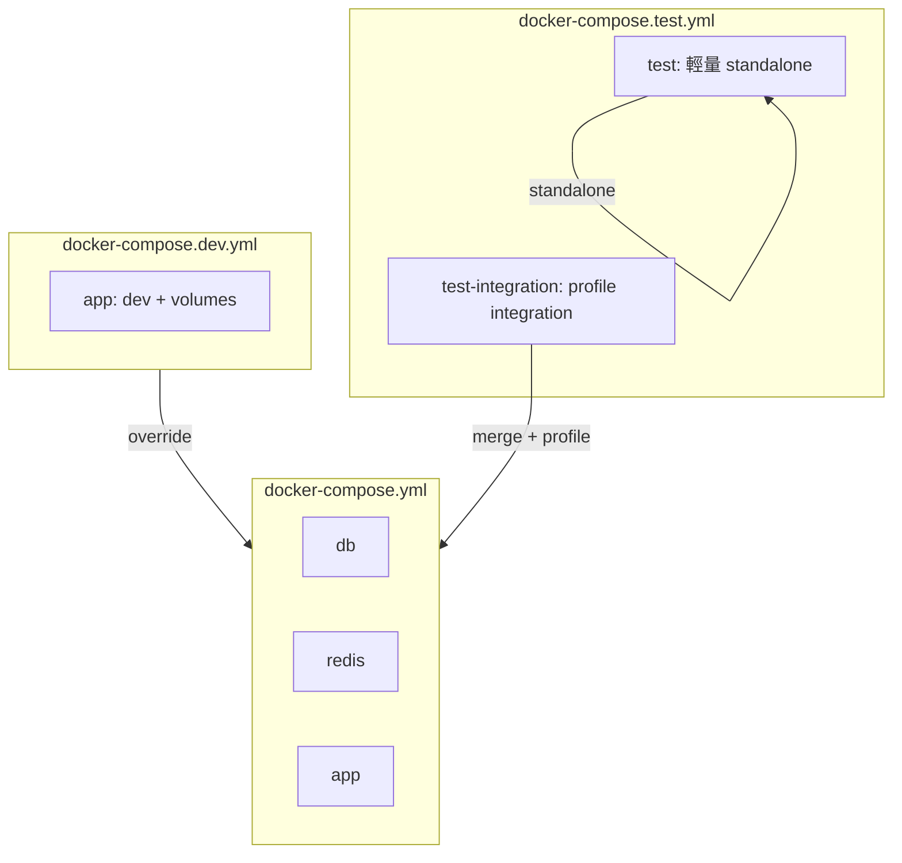

# 測試流程說明

本專案測試**統一走 Docker**，不以本機 `uv run pytest` 為標準流程。本文為 Agent 與開發者的單頁指引。

---

## 快速指令（Agent 標準）

```bash
# 標準測試（輕量，預設）— 每次改 code 後執行
./scripts/test.sh

# 指定檔案或 pytest 參數
./scripts/test.sh tests/test_base_repository_pagination.py -v

# Integration 測試（需 Postgres / Redis）
./scripts/test-integration.sh
```

---

## 分層策略

| 層級 | 指令 | 適用測試 | 依賴 |
|------|------|----------|------|
| 輕量（預設） | `./scripts/test.sh` | unit、BDD、SQLite stub | 無 db/redis |
| Integration | `./scripts/test-integration.sh` | 標記 `@pytest.mark.integration` 的測試 | db + redis + migration |

`pyproject.toml` 已註冊 marker：

```toml
markers = [
    "integration: tests requiring Postgres/Redis (deselect with '-m \"not integration\"')",
]
```

輕量腳本未來可改為 `pytest -m "not integration"`，與 integration 腳本互補，不需改 Compose 結構。

---

## Docker Compose 架構

三檔分工：

```
docker-compose.yml        # base：db、redis、app、worker、beat、flower（target: base）
docker-compose.dev.yml    # 開發覆寫：dev target + src/tests volume
docker-compose.test.yml   # 測試專用：test、test-integration（profile integration）
```



### Dockerfile stages

| Stage | 用途 | 內容 |
|-------|------|------|
| `base` | 正式部署 | `uv sync --no-dev`，不含 tests |
| `dev` | 開發 / 測試 | 含 `tests/`、`uv sync --extra dev`（pytest 等） |

---

## 腳本說明

| 腳本 | 執行位置 | 職責 |
|------|----------|------|
| `scripts/test.sh` | 主機 | build `test` 服務並 `docker compose run` |
| `scripts/test-integration.sh` | 主機 | 合併 base + test compose，`--profile integration` |
| `scripts/run-tests.sh` | 容器內 | test 服務 entrypoint：等待 db/redis、跑 migration、執行 pytest |
| `scripts/dev-up.sh` | 主機 | `docker compose -f ... -f docker-compose.dev.yml up -d --build` |
| `scripts/dev-down.sh` | 主機 | 對應 dev compose 的 `down -v` |

### 容器內直接跑（開發中）

`dev-up.sh` 啟動後，tests 已掛載至 app 容器：

```bash
docker compose -f docker-compose.yml -f docker-compose.dev.yml exec app uv run pytest -v
```

---

## 測試服務設定

### `test`（輕量）

- 獨立於 `docker-compose.test.yml`，不依賴 db/redis
- `build.target: dev`
- `entrypoint: /app/scripts/run-tests.sh`
- volumes：`src/`、`tests/`、`pyproject.toml`、`uv.lock`

### `test-integration`（integration profile）

- 合併 `docker-compose.yml` 取得 db/redis
- `depends_on` 等待 db/redis healthcheck 通過
- 環境變數與 app 一致，`RUN_MIGRATIONS=1` 於測試前執行 migration

---

## 撰寫測試指引

### 目錄慣例

```
tests/
├── test_*.py              # unit / integration
├── step_defs/             # pytest-bdd steps
└── features/              # Gherkin features
```

### 何時使用 `@pytest.mark.integration`

需真實 Postgres、Redis 或完整 stack 時才標記；其餘維持輕量（stub、SQLite、TestClient）。

```python
import pytest

@pytest.mark.integration
def test_user_repository_with_real_db(session):
    ...
```

### 依賴注入測試覆寫

見 [Wiring 模組-自動化依賴注入](Wiring%20模組-自動化依賴注入.md#測試覆寫)：

```python
with container.services.cart_service.override(providers.Object(stub_service)):
    response = client.get("/api/cart?user_id=1")
```

---

## 常見問題

### 為什麼不用本機 `uv run pytest`？

- 依賴版本與 CI/團隊環境一致（dev image 內 `uv sync --extra dev`）
- 不需手動掛載 volume 或覆寫 entrypoint
- Agent 有單一標準入口

本機 `uv run pytest` 可作為進階除錯手段，非官方主路徑。

### `test.sh` 會啟動 db/redis 嗎？

不會。`test` 服務為 standalone，適用現有全部輕量測試。

### Integration 腳本目前跑哪些測試？

目前跑全量 pytest（尚無 `@pytest.mark.integration` 案例）。未來可改為：

```bash
# scripts/test-integration.sh 內部或 run-tests.sh 傳參
pytest -m integration "$@"
```

---

## 相關文件

| 文件 | 內容 |
|------|------|
| [架構說明 - tests/ 測試層](架構說明.md#7-tests---測試層) | 測試分層與規範 |
| [架構說明 - Docker 環境](架構說明.md#11-啟動流程) | Compose 與啟動流程 |
| [錯誤處理架構說明](錯誤處理架構說明.md) | exception handler 測試範例 |
| [README 測試章節](../README.md#測試) | 快速開始摘要 |
