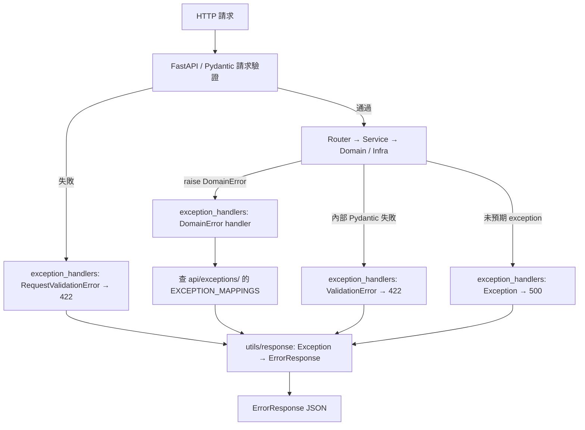

# 錯誤處理架構說明

## 概述

本文檔說明本專案如何分層定義、拋出與處理錯誤。目標是：

- **統一回應格式**：所有 API 錯誤都輸出 `ErrorResponse`（見 [API 統一回應格式說明](API%20統一回應格式說明.md)）
- **職責分離**：Core 只描述「業務上出了什麼問題」，API 決定「對外回什麼 HTTP status」
- **可擴展**：新增業務錯誤只需在 `core/exceptions/` 與 `api/exceptions/` 各加一檔，啟動時自動註冊

---

## 錯誤分層總覽

本專案的錯誤處理分為 **三類**，由不同模組負責：

| 類別 | 定義位置 | 註冊位置 | 典型來源 | 用途 |
|------|----------|----------|----------|------|
| **業務錯誤** | `core/exceptions/` | `api/exception_handlers.py` | Domain、Service、Infra | 可預期的業務規則違反 |
| **HTTP 映射** | `api/exceptions/` | `api/exception_handlers.py` | 開發者維護 | 業務錯誤 → HTTP status |
| **框架 / 兜底錯誤** | 無（Python / FastAPI 內建） | `api/exception_handlers.py` | FastAPI、Pydantic、未預期 bug | 請求驗證失敗、500 兜底 |



---

## 兩種「錯誤代碼」的區別

同一個錯誤回應中可能同時有兩種 code，用途不同：

| 欄位 | 型別 | 定義位置 | 用途 | 範例 |
|------|------|----------|------|------|
| `ErrorResponse.code` | `int` | `api/exceptions/` 映射 | HTTP / 粗分類 | `404`、`400`、`409` |
| `errors[].code` | `str` | `core/exceptions/` 的 `error_code` | 業務細分 | `CART_NOT_FOUND`、`INVALID_QUANTITY` |

**同一 HTTP status 可以對應多種業務錯誤。** 例如 `CartNotFoundError` 與 `EntityNotFoundError` 都是 404，但 JSON body 的 `errors[0].code` 分別是 `CART_NOT_FOUND` 與 `ENTITY_NOT_FOUND`。前端應依字串 `error_code` 做分支邏輯，而非只看 HTTP status。

**回應範例（404 + 業務 code）：**

```json
{
  "success": false,
  "code": 404,
  "message": "購物車 (user_id: u1) 不存在",
  "errors": [
    {
      "message": "購物車 (user_id: u1) 不存在",
      "code": "CART_NOT_FOUND"
    }
  ],
  "timestamp": "2024-01-01T12:00:00Z"
}
```

---

## Core 層：定義業務錯誤

### 目錄結構

```
core/exceptions/
├── base.py       # DomainError、DomainErrorDetail
├── cart.py       # CartNotFoundError、InvalidQuantityError
├── order.py      # InvalidOrderStateError、EmptyOrderError、...
└── common.py     # EntityNotFoundError、InvalidEntityTypeError（跨資源共用）
```

### 基底類別

`DomainError` 是所有業務錯誤的父類，**不含 HTTP status**：

```python
# core/exceptions/base.py
@dataclass(frozen=True)
class DomainErrorDetail:
    message: str
    field: str | None = None
    code: str | None = None

class DomainError(Exception):
    default_message: ClassVar[str] = "業務規則錯誤"
    default_error_code: ClassVar[str] = "DOMAIN_ERROR"

    def __init__(
        self,
        message: str | None = None,
        *,
        error_code: str | None = None,
        errors: list[DomainErrorDetail] | None = None,
    ) -> None: ...
```

| 屬性 | 說明 |
|------|------|
| `message` | 給人看的錯誤訊息，會出現在 `ErrorResponse.message` |
| `error_code` | 字串業務碼，會出現在 `errors[].code` |
| `errors` | 可選的欄位級錯誤列表（多欄位驗證時使用） |

### 定義子類的兩種方式

**方式 A：固定預設值（簡單錯誤）**

```python
# core/exceptions/cart.py
class InvalidQuantityError(DomainError):
    default_message = "quantity must be positive"
    default_error_code = "INVALID_QUANTITY"
```

使用：`raise InvalidQuantityError()`

**方式 B：動態訊息（需帶入 context）**

```python
# core/exceptions/cart.py
class CartNotFoundError(DomainError):
    default_error_code = "CART_NOT_FOUND"

    def __init__(self, user_id: str) -> None:
        super().__init__(
            message=f"購物車 (user_id: {user_id}) 不存在",
            error_code=self.default_error_code,
        )
```

使用：`raise CartNotFoundError(user_id)`

**方式 C：欄位級錯誤（多欄位）**

```python
raise SomeValidationError(
    message="輸入驗證失敗",
    error_code="VALIDATION_FAILED",
    errors=[
        DomainErrorDetail(field="email", message="格式不正確", code="INVALID_EMAIL"),
        DomainErrorDetail(field="name", message="不能為空", code="REQUIRED"),
    ],
)
```

### 命名規範

| 項目 | 規範 | 範例 |
|------|------|------|
| 類別名稱 | `{Problem}Error` 或 `{Resource}{Problem}Error` | `CartNotFoundError` |
| `error_code` | 大寫 snake case，語意穩定 | `CART_NOT_FOUND` |
| 檔案組織 | 按資源分檔；跨資源共用放 `common.py` | `cart.py`、`user.py`、`common.py` |

---

## API 層：HTTP 映射（不含錯誤定義）

### 目錄結構

```
api/exceptions/
├── cart.py       # CartNotFoundError → 404
├── order.py      # InvalidOrderStateError → 400, DuplicateOrderItemError → 409
└── common.py     # EntityNotFoundError → 404
```

**重要：`api/exceptions/` 不定義新的 exception 類別**，只維護映射表：

```python
# api/exceptions/cart.py
from app.core.exceptions.base import DomainError
from app.core.exceptions.cart import CartNotFoundError, InvalidQuantityError

EXCEPTION_MAPPINGS: dict[type[DomainError], int] = {
    CartNotFoundError: 404,
    InvalidQuantityError: 400,
}
```

同一 HTTP status 可以對應多個錯誤類型：

```python
# api/exceptions/order.py
EXCEPTION_MAPPINGS: dict[type[DomainError], int] = {
    InvalidOrderQuantityError: 400,
    InvalidOrderStateError: 400,
    DuplicateOrderItemError: 409,
    EmptyOrderError: 400,
    MissingShippingAddressError: 400,
}
```

---

## 自動發現與註冊

啟動時 [`api/exception_handlers.py`](../src/app/api/exception_handlers.py) 執行：

1. **掃描 `api/exceptions/`**：合併所有 `EXCEPTION_MAPPINGS`
2. **掃描 `core/exceptions/`**：收集所有 `DomainError` 子類
3. **驗證完整性**：任一子類缺少映射 → 啟動失敗（`RuntimeError`）
4. **註冊統一 handler**：`@app.exception_handler(DomainError)`，所有子類自動匹配

[`api/http_app.py`](../src/app/api/http_app.py) 僅呼叫 `register_exception_handlers(app)`，不含 handler 實作。

```python
# api/exception_handlers.py（簡化）
def register_exception_handlers(app: FastAPI) -> None:
    _register_domain_error_handlers(app)  # 業務錯誤（auto-discovery）
    _register_builtin_handlers(app)       # RequestValidationError、ValidationError、Exception
```

轉換邏輯集中在 [`api/utils/response.py`](../src/app/api/utils/response.py)：

```python
# utils/response.py
def domain_error_to_response(exc: DomainError, status_code: int) -> ErrorResponse:
    if exc.errors:
        details = [ErrorDetail(...) for detail in exc.errors]
    else:
        details = [ErrorDetail(message=exc.message, code=exc.error_code)]

    return ErrorResponse(
        success=False,
        code=status_code,       # 來自 api/exceptions/ 映射
        message=exc.message,    # 來自 core/exceptions/
        errors=details,
    )
```

---

## 內建 Handler（框架 / 兜底）

以下三種錯誤**不做 auto-discovery**，固定寫在 [`api/exception_handlers.py`](../src/app/api/exception_handlers.py) 的 `_register_builtin_handlers()`：

| Handler | Exception | HTTP | 觸發時機 | 目的 |
|---------|-----------|------|----------|------|
| `request_validation_error_handler` | `RequestValidationError` | 422 | 請求 body / query / path 驗證失敗 | 將 FastAPI 預設格式轉為 `ErrorResponse` |
| `pydantic_validation_error_handler` | `ValidationError` | 422 | 程式內部 Pydantic 驗證失敗 | 同上，欄位路徑解析略有不同 |
| `general_exception_handler` | `Exception` | 500 | 未預期的 bug、第三方庫錯誤 | 兜底，避免洩漏內部細節 |

**為什麼不放入 auto-discovery？**

- 不是 `DomainError`，不屬於 core 業務語意
- 行為固定、與資源無關，不需要 `EXCEPTION_MAPPINGS`
- `RequestValidationError` / `ValidationError` 需解析 Pydantic 特有的 `exc.errors()` 結構

**Handler 匹配順序：** FastAPI 選最匹配的 handler。`CartNotFoundError` 會走 `DomainError` handler，不會落到 `Exception` handler。

---

## 各層如何使用

### 依賴方向

```
Router  →  Service  →  Domain
              ↓            ↓
           Infra  →  core/exceptions/（raise）
                              ↑
api/exceptions/（HTTP 映射，僅 discovery 使用）
```

| 層級 | import 來源 | 做什麼 | 不做什么 |
|------|------------|--------|----------|
| **Domain** | `core/exceptions/{resource}` | `raise InvalidQuantityError()` | 不設定 HTTP status |
| **Service** | 同上 | 驗證後 `raise`，或讓 Domain 錯誤往上冒 | 不組 `ErrorResponse` |
| **Infra** | `core/exceptions/{resource}` 或 `common` | DB 查無、型別錯誤時 `raise` | 不 import `api/exceptions/` |
| **Router** | 通常不 import exception | 呼叫 Service，讓錯誤自然往上冒 | 不用 `HTTPException`、不用 `try/except` 組錯誤 JSON |
| **測試** | `core/exceptions/*` | `pytest.raises(InvalidQuantityError)` | — |

### Infra 範例

```python
# infra/db/repositories/base_repository.py
from app.core.exceptions.common import EntityNotFoundError, InvalidEntityTypeError

def get_or_404(self, _id: Any) -> Base:
    instance = self.get(_id)
    if instance is None:
        raise EntityNotFoundError(self.__model__.__name__, entity_id=_id)
    return instance
```

### Router 範例

```python
# api/routers/carts.py
@router.post("/cart/items", response_model=ApiResponse[CartOut])
def add_item(user_id: str, body: AddItemIn, service: CartServiceDep):
    cart = service.add_item(
        user_id=user_id,
        product_id=body.product_id,
        unit_price=body.unit_price,
        quantity=body.quantity,
    )
    return created_response(data=cart_out_from_domain(cart), message="商品已成功加入購物車")
    # quantity <= 0 時 Service 拋 InvalidQuantityError，handler 自動回 400
```

---

## 新增業務錯誤：標準流程

以新增 `EmailAlreadyExistsError` 為例：

### Step 1：在 Core 定義錯誤

```python
# core/exceptions/user.py
from app.core.exceptions.base import DomainError

class EmailAlreadyExistsError(DomainError):
    default_message = "Email 已被使用"
    default_error_code = "EMAIL_ALREADY_EXISTS"

class UserNotFoundError(DomainError):
    default_error_code = "USER_NOT_FOUND"

    def __init__(self, user_id: int) -> None:
        super().__init__(
            message=f"User (id: {user_id}) 不存在",
            error_code=self.default_error_code,
        )
```

若只是「查無資料」，可重用 `EntityNotFoundError`，不必新建類別。

### Step 2：在 API 定義 HTTP 映射

```python
# api/exceptions/user.py
from app.core.exceptions.base import DomainError
from app.core.exceptions.user import EmailAlreadyExistsError, UserNotFoundError

EXCEPTION_MAPPINGS: dict[type[DomainError], int] = {
    EmailAlreadyExistsError: 409,
    UserNotFoundError: 404,
}
```

### Step 3：在 Domain / Service / Infra 中 raise

```python
# core/services/user_service.py
from app.core.exceptions.user import EmailAlreadyExistsError

def create_user(self, email: str, name: str) -> User:
    if self.user_repo.exists_by_email(email):
        raise EmailAlreadyExistsError()
    ...
```

### Step 4：重啟服務

- Discovery 自動註冊，**無需修改 `http_app.py`**
- 若忘記 Step 2，啟動時會報 `Missing HTTP mappings for DomainError subclasses: ...`

### 檢查清單

- [ ] 在 `core/exceptions/{resource}.py` 新增 `DomainError` 子類
- [ ] 設定 `default_error_code`（及必要時的 `default_message`）
- [ ] 在 `api/exceptions/{resource}.py` 新增 `EXCEPTION_MAPPINGS` 項目
- [ ] 在 Domain / Service / Infra 以 `raise` 使用
- [ ] Router 不手動處理該錯誤
- [ ] 新增或更新測試（assert 拋出的 exception 類型與 API 回應格式）

---

## 完整請求流程範例

以「加入購物車時 quantity = 0」為例：

```
1. POST /api/cart/items?user_id=u1
   body: { "product_id": "p1", "unit_price": 100, "quantity": 0 }

2. FastAPI 驗證 AddItemIn（Pydantic）→ 通過（quantity 是 int，只是值不合法）

3. Router 呼叫 service.add_item(...)

4. Service / Domain 拋出 InvalidQuantityError()

5. exception_handlers 的 DomainError handler：
   - 查映射：InvalidQuantityError → 400
   - 組 ErrorResponse

6. 回應：
   HTTP 400
   {
     "success": false,
     "code": 400,
     "message": "quantity must be positive",
     "errors": [{ "message": "quantity must be positive", "code": "INVALID_QUANTITY" }]
   }
```

以「請求 body 缺欄位」為例：

```
1. POST /api/cart/items（缺少 product_id）

2. FastAPI 拋 RequestValidationError

3. exception_handlers 的 request_validation_error_handler → 422 + ErrorResponse

4. Router / Service 根本不會被執行
```

---

## 最佳實踐

### 應該做的

1. **一種業務差異 = 一個 exception 子類（或明確的 `error_code`）**
2. **`error_code` 使用穩定字串常數**，方便前端 i18n 與監控
3. **Infra / Domain / Service 只 raise，不處理 HTTP**
4. **重用 `common.py` 的通用錯誤**（如 `EntityNotFoundError`）避免重複定義
5. **同一 HTTP status 下用不同 `error_code` 區分業務細節**

### 不應該做的

1. **不要在 core 寫 HTTP status**（如 `status_code=404`）
2. **不要在 Router 用 `HTTPException` 手動組錯誤**（應 `raise DomainError`）
3. **不要在 Infra import `api/exceptions/`**
4. **不要用 `ValueError` 表達業務錯誤**（已全面遷移至 `DomainError`）
5. **不要跳過 `api/exceptions/` 映射**（啟動驗證會擋，且 HTTP status 無定義）

---

## 與其他文件的關係

| 文件 | 內容 |
|------|------|
| [API 統一回應格式說明](API%20統一回應格式說明.md) | `ErrorResponse` / `ErrorDetail` schema 與回應範例 |
| [API 層架構設計](API%20層架構設計.md) | API 目錄結構（含 `exceptions/`、`exception_handlers.py`） |
| [Clean Architecture 同心圓架構詳解](Clean%20Architecture%20同心圓架構詳解.md) | 整體分層與依賴方向 |
| [新增功能指南-User CRUD-01-基礎架構](新增功能指南-User%20CRUD-01-基礎架構.md) | 新增資源時的整體步驟 |

---

## 相關原始碼

| 檔案 | 職責 |
|------|------|
| [`core/exceptions/base.py`](../src/app/core/exceptions/base.py) | `DomainError` 基底 |
| [`api/exception_handlers.py`](../src/app/api/exception_handlers.py) | 掃描、驗證、註冊全部 handler（DomainError + 內建） |
| [`api/utils/response.py`](../src/app/api/utils/response.py) | Exception → `ErrorResponse` 轉換 helper |
| [`api/http_app.py`](../src/app/api/http_app.py) | FastAPI 實例建立，呼叫 `register_exception_handlers()` |
| [`api/schemas/response.py`](../src/app/api/schemas/response.py) | `ErrorResponse`、`ErrorDetail` |
| [`tests/test_exception_handlers.py`](../tests/test_exception_handlers.py) | Discovery、helper 與 handler 測試 |

---

## 總結

| 問題 | 答案 |
|------|------|
| 錯誤定義在哪？ | `core/exceptions/`（業務語意 + 字串 `error_code`） |
| HTTP status 在哪？ | `api/exceptions/` 的 `EXCEPTION_MAPPINGS` |
| 誰負責 raise？ | Domain、Service、Infra |
| 誰負責轉 JSON？ | `utils/response.py`（轉換）+ `exception_handlers.py`（註冊 handler） |
| 新增錯誤要改 `http_app.py` 嗎？ | **不用**（業務錯誤）；框架 handler 已在 `exception_handlers.py` 固定 |
| 404 能有多種業務差異嗎？ | **可以**，靠不同的 `error_code`（如 `CART_NOT_FOUND` vs `USER_NOT_FOUND`） |
